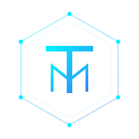

# ThreatMatrix AI — Brand Identity & Design System

> **Draft Version:** 1.0.0 | **Date:** 2026-02-23  
> **Prepared for:** ThreatMatrix AI Core Team

---

## 1. The Core Identity

**ThreatMatrix AI** is built on the philosophy of "Intelligence Agency Grade" cybersecurity. The branding must reflect **authority, precision, and the power of artificial intelligence.**

### 1.1 Brand Attributes

- **Authoritative**: Secure and robust.
- **Future-Forward**: Powered by AI/ML.
- **Data-Driven**: Focused on network flows and matrices.
- **Premium**: High-end software for mission-critical operations.

---

## 2. Visual Identity

### 2.1 Logo Mark (The Sentinel Hexagon)

The logo mark is a **Hexagonal Perimeter** symbolizing a secured network boundary. Inside, a stylized **TM** (ThreatMatrix) is woven into the geometry, representing the integration of intelligence into every corner of the matrix.

### 2.2 Typography

- **Primary (UI)**: **Inter** — Modern, legible, and crisp for dashboard interfaces.
- **Data (Metrics)**: **JetBrains Mono** — For packet data, IP addresses, and the "AI Analyst" terminal interface.

### 2.3 Color Palette

| Name               | Hex       | Usage                                  |
| :----------------- | :-------- | :------------------------------------- |
| **Obsidian Black** | `#0a0a0f` | Main background surface                |
| **Cyber Cyan**     | `#00f0ff` | Primary accent, glows, and activity    |
| **Matrix Blue**    | `#3b82f6` | Secondary accent, interactive elements |
| **Critical Red**   | `#ef4444` | High-severity alerts and anomalies     |

---

## 3. Logo Variations Concept

We are developing four core high-fidelity variations for different use cases:

1.  **The Tactical Shield**: A focus on defense, using matrix grid lines to form a shield.
2.  **The Neural Flow**: An organic yet digital flow representation of network packets forming a node.
3.  **The Monogram Peak**: A minimalist, elite branding using a sharp "TM" icon.
4.  **The Orbital Eye**: A surveillance/radar motif representing the "Intelligence Engine".

---

## 4. Design Aesthetics: Glassmorphism

The platform utilizes **Glassmorphism** for its primary container system.

- **Backdrop Blur**: `12px`
- **Transparency**: `0.03`
- **Border**: `rgba(255, 255, 255, 0.06)`

This creates a depth effect reminiscent of modern HUD (Heads-Up Display) military technology.

---

_© 2026 ThreatMatrix AI. All rights reserved._
