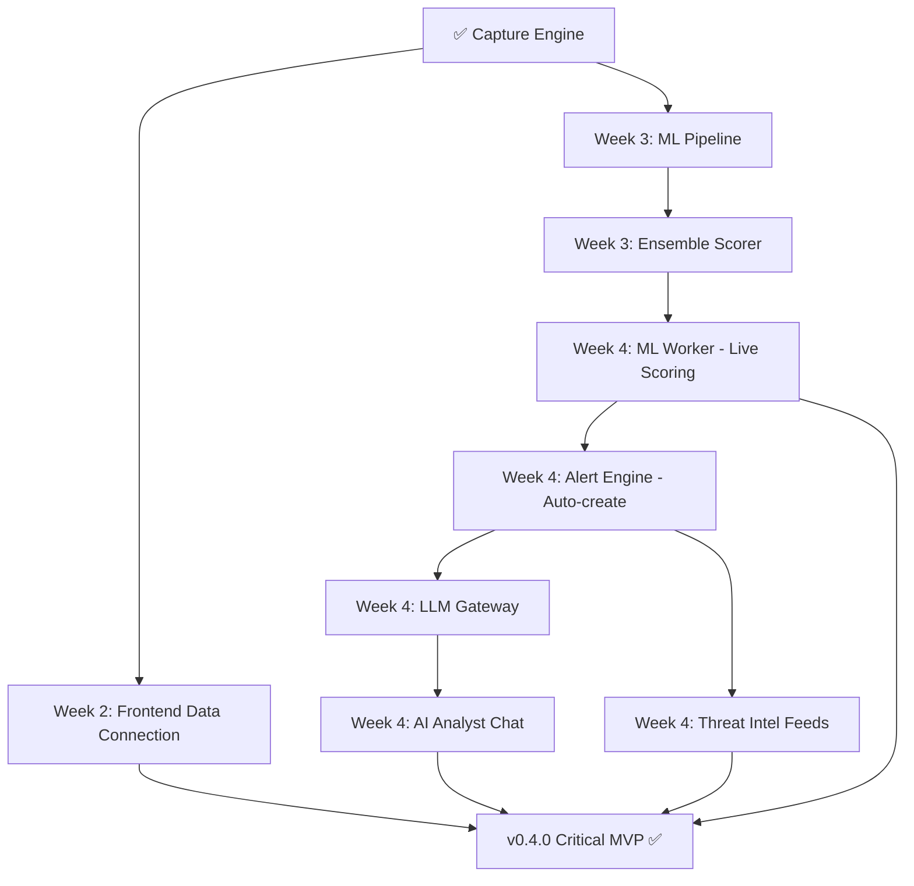

# ThreatMatrix AI — Full Project Audit
## Week 2, Day 8 Entry Assessment (March 22, 2026)

> **Audit Date:** 2026-03-22 23:40 UTC+3  
> **Auditor:** AI Pair Programmer  
> **Phase:** Week 2 Day 1 COMPLETE → Entering Day 8  
> **Overall Status:** ✅ **ON TRACK** — Slightly Ahead of Schedule

---

## 📊 EXECUTIVE SUMMARY

| Dimension | Rating | Details |
|-----------|--------|---------|
| **Schedule** | ✅ **Ahead** | Day 7 (Week 2 Day 1) complete. Capture engine operational — originally a full-week deliverable — done in 1 day |
| **Architecture Compliance** | ✅ **Excellent** | Three-tier architecture faithfully implemented per MASTER_DOC_PART2 |
| **Scope Compliance** | ✅ **No Violations** | No additions outside the 10 defined modules |
| **Code Quality** | ✅ **Good** | Type hints, Pydantic models, async/await, SQLAlchemy 2.x — all per spec |
| **VPS Operations** | ✅ **Fully Operational** | 5 Docker services running, live traffic capture active |
| **Risk Level** | 🟡 **Medium** | ML Pipeline (Week 3) and LLM Integration (Week 4) are the critical upcoming challenges |

---

## 🗓️ TIMELINE POSITION

```
Week 1 (Feb 24 - Mar 2)  ██████████████████████ COMPLETE ✅ v0.1.0
Week 2 (Mar 3 - Mar 9)   ██░░░░░░░░░░░░░░░░░░░ Day 1 DONE, Day 8 STARTING
Week 3 (Mar 10 - Mar 16) ░░░░░░░░░░░░░░░░░░░░░ ML Pipeline
Week 4 (Mar 17 - Mar 23) ░░░░░░░░░░░░░░░░░░░░░ LLM + Threat Intel = CRITICAL MVP
Week 5 (Mar 24 - Mar 30) ░░░░░░░░░░░░░░░░░░░░░ Feature Depth
Week 6 (Mar 31 - Apr 6)  ░░░░░░░░░░░░░░░░░░░░░ Reports + Enterprise
Week 7 (Apr 7 - Apr 13)  ░░░░░░░░░░░░░░░░░░░░░ Polish + i18n
Week 8 (Apr 14 - Apr 20) ░░░░░░░░░░░░░░░░░░░░░ Final Push 🚀
─────────────────────────────────────────────────────────  
                                            ▲ YOU ARE HERE
                                        Day 8 (12.5% in)
```

> [!TIP]
> **You're slightly ahead of schedule.** The capture engine (entire Week 2 deliverable per MASTER_DOC_PART5 §3) was completed on Day 1 of Week 2. This gives you buffer for the remaining Week 2 tasks and the critical Week 3 ML pipeline.

---

## ✅ WHAT HAS BEEN ACCOMPLISHED (Days 1-7)

### Week 1 (Days 1-6) — Foundation ✅ `v0.1.0`

| Deliverable | Status | Evidence |
|-------------|--------|----------|
| Monorepo structure | ✅ | `threatmatrix-ai/` with `backend/`, `frontend/`, `docs/`, [docker-compose.yml](file:///c:/Users/kidus/Documents/Projects/threatmatrix-ai/docker-compose.yml) |
| PostgreSQL schema + migrations | ✅ | 10 tables, 2 Alembic migrations, indexes per PART2 §4.2 |
| FastAPI skeleton with CORS, OpenAPI | ✅ | `/docs` showing all endpoints at `:8000/docs` |
| Auth system (JWT + RBAC + DEV_MODE) | ✅ | 5 auth endpoints, 4 roles, dev bypass |
| Redis setup + pub/sub | ✅ | Redis 7-alpine, flows:live channel operational |
| Next.js 16 init with App Router | ✅ | 10 module pages, dark layout |
| Design system (CSS variables) | ✅ | 21KB `globals.css` with full War Room palette |
| Layout components | ✅ | Sidebar (64px icons), TopBar (56px), StatusBar (32px) — per PART3 §1.5 |
| War Room components (9) | ✅ | ThreatMap, MetricCard, ProtocolChart, TrafficTimeline, LiveAlertFeed, ThreatLevel, TopTalkers, GeoDistribution, AIBriefingWidget |
| AI Analyst components (3) | ✅ | ChatInterface, QuickActions, ContextPanel |
| Alert component (1) | ✅ | AlertDetailDrawer |
| Shared components (4) | ✅ | GlassPanel, DataTable, StatusBadge, LoadingState |
| Hooks (4) | ✅ | useWebSocket, useFlows, useAlerts, useLLM |
| API client library | ✅ | `api.ts`, `websocket.ts`, `constants.ts`, `utils.ts` |
| Docker Compose (5 services) | ✅ | postgres, redis, backend, capture, ml-worker |
| Mock data seeder | ✅ | 500 flows + 25 alerts |
| 7 daily worklogs (with PDFs) | ✅ | Comprehensive development history |

### Week 2 Day 1 (Day 7) — Capture Engine ✅

| Deliverable | Status | Evidence |
|-------------|--------|----------|
| Scapy capture engine on VPS | ✅ | `tm-capture` container running, sniffing `eth0` |
| Flow aggregation (5-tuple bidirectional) | ✅ | `flow_aggregator.py` — 7.5KB |
| Feature extraction (40+ features) | ✅ | `feature_extractor.py` — 10KB |
| Redis pub/sub (flows:live) | ✅ | `publisher.py` — 4.1KB, flows publishing |
| Capture API endpoints (4) | ✅ | `/capture/status`, `/start`, `/stop`, `/interfaces` |
| Flow persistence (Redis → PostgreSQL) | ✅ | `flow_consumer.py` — 8.9KB, batch inserts |
| VPS fully operational | ✅ | All 5 Docker services running at `187.124.45.161` |
| UUID/is_anomaly bug fixes | ✅ | Migration `20260322_000001` + SQL fixes |

### VPS Infrastructure ✅

| Component | Status | Details |
|-----------|--------|---------|
| Hostinger KVM 4 | ✅ | 4 vCPU, 16 GB RAM, 200 GB NVMe, France |
| Ubuntu 22.04 LTS | ✅ | Per MASTER_DOC_PART2 §3.1 |
| Docker + Compose V2 | ✅ | All services containerized |
| PostgreSQL 16 | ✅ Healthy | Port 5432, 10 tables |
| Redis 7 | ✅ Healthy | Port 6379, pub/sub active |
| FastAPI Backend | ✅ Running | Port 8000, DEV_MODE=true |
| Capture Engine | ✅ Running | Host network, privileged |
| ML Worker | 🟡 Expected restart | No models trained yet — Week 3 |

---

## 📁 CODEBASE INVENTORY

### Backend (`backend/`)

| Directory | Files | Description | Status |
|-----------|-------|-------------|--------|
| `app/api/v1/` | 7 files | API routes (auth, flows, alerts, capture, system, websocket, __init__) | ✅ |
| `app/models/` | 12 files | SQLAlchemy models (all 10 DB entities + base + init) | ✅ |
| `app/schemas/` | 8 files | Pydantic schemas (auth, flow, alert, capture, intel, ml, common, init) | ✅ |
| `app/services/` | 6 files | Business logic (auth, flow, alert, flow_consumer, flow_persistence, init) | ✅ |
| `app/` core | 4 files | main.py, config.py, database.py, dependencies.py, redis.py | ✅ |
| `capture/` | 6 files | engine, flow_aggregator, feature_extractor, publisher, config, init | ✅ |
| `alembic/versions/` | 2 files | Initial schema + UUID defaults fix | ✅ |
| Root | 4 files | Dockerfile, requirements.txt, alembic.ini, seed_mock_data.py, create_admin.py | ✅ |

**Total backend files: ~47**

### Frontend (`frontend/`)

| Directory | Files | Description | Status |
|-----------|-------|-------------|--------|
| `app/` | 10 module dirs + 5 files | All 10 route pages + layout + globals.css | ✅ |
| `components/war-room/` | 9 files | All War Room widgets (ThreatMap, MetricCard, etc.) | ✅ |
| `components/layout/` | 3 files | Sidebar, TopBar, StatusBar | ✅ |
| `components/shared/` | 4 files | GlassPanel, DataTable, StatusBadge, LoadingState | ✅ |
| `components/ai-analyst/` | 3 files | ChatInterface, QuickActions, ContextPanel | ✅ |
| `components/alerts/` | 1 file | AlertDetailDrawer | ✅ |
| `hooks/` | 4 files | useWebSocket, useFlows, useAlerts, useLLM | ✅ |
| `lib/` | 4 files | api.ts, websocket.ts, constants.ts, utils.ts | ✅ |

**Total frontend files: ~43**

### Documentation (`docs/`)

| File/Dir | Size | Status |
|----------|------|--------|
| `master-documentation/` (5 parts) | ~210KB total | ✅ Complete, Source of Truth |
| `worklog/` (7 days + PDFs + reports) | ~16 files | ✅ Comprehensive |
| `SESSION_HANDOFF.md` | 21.6KB | ✅ Updated for Day 7 |
| `FRONTEND_TASKS_DAY8.md` | 15.1KB | ✅ Full-stack dev task sheet |
| Other docs (6 files) | Various | ✅ Supporting documentation |

---

## 📊 API ENDPOINT COVERAGE

### Implemented: 23 endpoints (18 REST + 4 Capture + 1 WebSocket)

| Service | Implemented | Planned Total | Coverage |
|---------|-------------|---------------|----------|
| Auth | 5 | 5 | **100%** ✅ |
| Flows | 6 | 6 | **100%** ✅ |
| Alerts | 5 | 5 | **100%** ✅ |
| Capture | 4 | 5 | **80%** (upload-pcap = Week 5) |
| System | 2 | 3 | **67%** |
| WebSocket | 1 | 1 | **100%** ✅ |
| ML | 0 | 5 | **0%** (Week 3) |
| Intel | 0 | 4 | **0%** (Week 4) |
| LLM | 0 | 5 | **0%** (Week 4) |
| Reports | 0 | 3 | **0%** (Week 6) |
| **TOTAL** | **23** | **42** | **54.8%** |

> [!NOTE]
> **54.8% endpoint coverage at 12.5% timeline** is excellent. The remaining endpoints are all scheduled for Weeks 3-6, which is on-plan.

---

## ❌ WHAT'S MISSING (By Priority)

### 🔴 Critical Missing (Week 2 Remaining — Days 8-13)

| Item | Source | Assignee | Priority |
|------|--------|----------|----------|
| Connect frontend to VPS API (`NEXT_PUBLIC_API_URL`) | PART5 §3 Week 2 | Full-Stack Dev | 🔴 |
| Wire War Room components to live VPS data | PART3 §2 | Full-Stack Dev | 🔴 |
| WebSocket client connecting to VPS | PART2 §6 | Full-Stack Dev | 🔴 |
| ThreatMap rendering live flow geo-IP dots | PART3 §2.4 | Full-Stack Dev | 🔴 |
| Capture engine refinement + feature validation | PART4 §3 | Lead Architect | 🔴 |
| Feature extraction validation vs NSL-KDD format | PART4 §3.1 | Lead Architect | 🔴 |

### 🟠 High Missing (Week 3 — ML Pipeline)

| Item | Source | Priority |
|------|--------|----------|
| Download + prepare NSL-KDD dataset | PART4 §2.1 | 🟠 |
| Train Isolation Forest model | PART4 §4 | 🟠 |
| Train Random Forest model | PART4 §5 | 🟠 |
| Train Autoencoder (TensorFlow) | PART4 §6 | 🟠 |
| Ensemble scorer implementation | PART4 §1.2 | 🟠 |
| Model evaluation framework | PART4 §7 | 🟠 |
| `backend/ml/` directory structure | PART5 §2.1 | 🟠 |
| ML API endpoints (5) | PART2 §5.1 | 🟠 |

### 🟡 Medium Missing (Weeks 4-6)

| Item | Source | Planned Week |
|------|--------|-------------|
| LLM Gateway service (multi-provider) | PART4 §9 | Week 4 |
| AI Analyst backend (chat, briefing endpoints) | PART4 §9.2 | Week 4 |
| Threat intel aggregator (OTX, AbuseIPDB) | PART4 §11 | Week 4 |
| Real-time ML inference pipeline (ML Worker) | PART4 §8 | Week 4 |
| Alert engine: auto-create from anomalies | PART2 §5.1 | Week 4 |
| PCAP upload + analysis | PART2 §5.1 | Week 5 |
| CICIDS2017 dataset validation | PART4 §2.2 | Week 5 |
| PDF report generation | PART2 §5.1 | Week 6 |
| RBAC enforcement on all endpoints | PART2 §7 | Week 6 |
| LLM budget tracking | PART4 §10 | Week 6 |

### 🟢 Low Missing (Weeks 7-8)

| Item | Source | Planned Week |
|------|--------|-------------|
| Amharic/English i18n | PART3 §1 | Week 7 |
| Animations (Framer Motion) | PART3 §1.4 | Week 7 |
| Attack simulation scripts | PART5 §7.3 | Week 7 |
| SSL/HTTPS on VPS | PART5 §6 | Week 8 |
| Nginx reverse proxy | PART2 §3.1 | Week 8 |
| Production hardening | PART5 §6.2 | Week 8 |

---

## 🏗️ ARCHITECTURE COMPLIANCE AUDIT

### Three-Tier Architecture

| Tier | Spec (PART2 §2) | Implementation | Verdict |
|------|-----------------|----------------|---------|
| **Tier 1: Capture Engine** | Scapy, flow aggregation, 40+ features, Redis pub/sub | ✅ All implemented in `backend/capture/` (5 files, ~34KB) | **COMPLIANT** ✅ |
| **Tier 2: Intelligence Engine** | FastAPI, PostgreSQL, Redis, ML Worker, LLM Gateway | ✅ Core complete (FastAPI + DB + Redis). ML/LLM pending Weeks 3-4 | **ON TRACK** ✅ |
| **Tier 3: Command Center** | Next.js 16, TypeScript, Deck.gl, Recharts | ✅ Shell complete. 10 pages, 20+ components. Data connection pending | **ON TRACK** ✅ |

### Technology Stack Compliance

| Tech | Specified (PART2 §8) | Actual | Verdict |
|------|-------------------|---------| --------|
| Next.js 16 | ✅ | ✅ App Router | ✅ |
| TypeScript strict | ✅ | ✅ tsconfig strict | ✅ |
| Vanilla CSS + CSS Variables | ✅ | ✅ 21KB globals.css | ✅ |
| Deck.gl + Maplibre | ✅ | ✅ ThreatMap component | ✅ |
| Recharts | ✅ | ✅ Charts in War Room | ✅ |
| FastAPI | ✅ | ✅ v0.115+ | ✅ |
| Python 3.11+ | ✅ | ✅ | ✅ |
| PostgreSQL 16 | ✅ | ✅ Docker | ✅ |
| Redis 7 | ✅ | ✅ Docker | ✅ |
| Scapy | ✅ | ✅ capture engine | ✅ |
| Docker Compose V2 | ✅ | ✅ 5 services | ✅ |
| Lucide React (icons) | ✅ | ✅ package.json | ✅ |
| Inter + JetBrains Mono | ✅ | ✅ globals.css | ✅ |

> [!IMPORTANT]
> **Zero stack deviations detected.** Every technology choice matches the master documentation exactly.

### Database Schema Compliance

| Table | Spec (PART2 §4.2) | Implemented | Fields Match |
|-------|-------------------|-------------|---------------|
| `users` | ✅ | ✅ | ✅ |
| `network_flows` | ✅ | ✅ | ✅ (JSONB features, INET IPs) |
| `alerts` | ✅ | ✅ | ✅ |
| `threat_intel_iocs` | ✅ | ✅ | ✅ |
| `ml_models` | ✅ | ✅ | ✅ |
| `capture_sessions` | ✅ | ✅ | ✅ |
| `pcap_uploads` | ✅ | ✅ | ✅ |
| `llm_conversations` | ✅ | ✅ | ✅ |
| `system_config` | ✅ | ✅ | ✅ |
| `audit_log` | ✅ | ✅ | ✅ |

**10/10 tables — 100% schema compliance** ✅

### Module Compliance (10 Modules)

| # | Module | Route | Frontend | Backend | Overall |
|---|--------|-------|----------|---------|---------|
| 1 | War Room | `/war-room` | ✅ 9 components + page + CSS | ✅ Flow/Alert APIs | **Shell Complete** |
| 2 | Threat Hunt | `/hunt` | 📋 Stub page | 📋 Week 4 | **Stub** |
| 3 | Intel Hub | `/intel` | 📋 Stub page | 📋 Week 4 | **Stub** |
| 4 | Network Flow | `/network` | 📋 Stub page | ✅ Flow APIs | **Backend Ready** |
| 5 | AI Analyst | `/ai-analyst` | ✅ 3 components | 📋 Week 4 | **Frontend Ready** |
| 6 | Alert Console | `/alerts` | ✅ 1 component (drawer) | ✅ Alert APIs | **Partial** |
| 7 | Forensics Lab | `/forensics` | 📋 Stub page | 📋 Week 5 | **Stub** |
| 8 | ML Operations | `/ml-ops` | 📋 Stub page | 📋 Week 3 | **Stub** |
| 9 | Reports | `/reports` | 📋 Stub page | 📋 Week 6 | **Stub** |
| 10 | Administration | `/admin` | 📋 Stub page | 📋 Week 6 | **Stub** |

---

## ⚠️ KNOWN ISSUES & RISKS

### Active Issues

| Issue | Severity | Impact | Mitigation |
|-------|----------|--------|------------|
| Next.js 16 build error (`workUnitAsyncStorage`) | 🟡 Medium | `npm run dev` works; production build fails on error pages | Known Next.js 16 framework bug. Wait for patch or apply workaround before Week 8 |
| `ml-worker` container restarting | 🟢 Low | Expected — `python -m ml.inference.worker` fails since no `ml/` module exists yet | Will resolve in Week 3 when ML pipeline is implemented |
| DEV_MODE=true on VPS | 🟡 Medium | Auth bypassed; security risk if VPS is publicly accessible on port 8000 | Must disable before production/demo. UFW firewall should limit access |
| Docker `version: "3.8"` warning | 🟢 Cosmetic | `docker compose` shows deprecation warning | Remove `version` key from docker-compose.yml |
| No LLM/Intel API keys | 🟢 Expected | Not needed until Week 4 | On schedule |
| Frontend not connected to VPS | 🟡 Medium | War Room shows mock/placeholder data, not live VPS data | Day 8 critical task for Full-Stack Dev |

### Risk Assessment

| Risk | Probability | Impact | Mitigation |
|------|-------------|--------|------------|
| **ML accuracy below target (≥95%)** | Medium | High | Three models (one will perform). NSL-KDD is well-studied. Hyperparameter tuning. |
| **LLM budget overrun** | Low | Medium | Token tracking, response caching, rate limiting, provider fallback |
| **Full-stack dev falls behind on UI** | Medium | High | Lead architect has Next.js expertise (Pana ERP) and can pivot |
| **VPS downtime during demo** | Low | Critical | Docker restart policies, pre-recorded demo backup |
| **Scope creep** | Medium | High | 10 modules locked. Master doc is law. |
| **Week 4 MVP deadline pressure** | Medium | Critical | Capture engine done early gives buffer. Focus on ML Week 3 |

---

## 📈 PROGRESS BY VERSION MILESTONE

| Version | Target Date | Required Deliverables | Status |
|---------|-------------|----------------------|--------|
| `v0.1.0` | Week 1 (Mar 2) | Skeleton, DB, auth, UI shell | ✅ **COMPLETE** |
| `v0.2.0` | Week 2 (Mar 9) | Capture engine, flow storage, War Room layout | 🟡 **IN PROGRESS** (capture ✅, frontend connection pending) |
| `v0.3.0` | Week 3 (Mar 16) | ML models trained, scoring, map + charts | 📋 Upcoming |
| **`v0.4.0`** | **Week 4 (Mar 23)** | **LLM, AI Analyst, threat intel, alerts — CRITICAL MVP** | 📋 **Must Ship** |
| `v0.5.0` | Week 5 (Mar 30) | PCAP forensics, ML dashboards, full War Room | 📋 |
| `v0.6.0` | Week 6 (Apr 6) | Reports, admin, RBAC, budget | 📋 |
| `v0.7.0` | Week 7 (Apr 13) | Polish, animations, i18n | 📋 |
| `v1.0.0` | Week 8 (Apr 20) | Production deploy, final fixes | 📋 🚀 |

---

## 🎯 DAY 8 PRIORITIES

### Lead Architect (You)

| # | Task | Priority | Time Est | Deliverable |
|---|------|----------|----------|-------------|
| 1 | Capture engine refinement + edge case testing | 🔴 | 2h | Robust capture with graceful error handling |
| 2 | Feature extraction validation against NSL-KDD column mapping | 🔴 | 2h | Feature vectors compatible with NSL-KDD format |
| 3 | Docker Compose cleanup (remove `version` warning) | 🟢 | 5m | Clean docker-compose.yml |
| 4 | Begin `backend/ml/` directory scaffolding for Week 3 | 🟡 | 1h | ML module structure ready |

### Full-Stack Developer

| # | Task | Priority | Time Est | Deliverable |
|---|------|----------|----------|-------------|
| 1 | Update `.env` with `NEXT_PUBLIC_API_URL=http://187.124.45.161:8000` | 🔴 | 5m | Frontend points to live VPS |
| 2 | Verify `useWebSocket` connects to VPS WebSocket | 🔴 | 1h | Real-time events in browser |
| 3 | Wire MetricCard, ProtocolChart to live flow data | 🔴 | 2h | War Room showing real stats |
| 4 | ThreatMap rendering live flow geo-IP data | 🔴 | 2h | Deck.gl showing traffic on map |
| 5 | War Room layout polish per PART3 §2.2 | 🟡 | 1h | Grid matches spec |

---

## 📋 WEEK 2 REMAINING TASKS (Days 8-13)

Per MASTER_DOC_PART5 §3 Week 2:

| Task | Owner | Status | Notes |
|------|-------|--------|-------|
| Scapy capture engine: packet sniffing, flow aggregation | Lead | ✅ **DONE** | Completed Day 7 |
| Feature extraction pipeline (40+ features) | Lead | ✅ **DONE** | Completed Day 7 |
| Redis pub/sub integration (capture → Redis → API) | Lead | ✅ **DONE** | Completed Day 7 |
| War Room layout: grid structure, all component shells | Full-Stack | ✅ **DONE** | Completed Week 1 |
| MetricCard, StatusBadge, DataTable components | Full-Stack | ✅ **DONE** | Completed Week 1 |
| WebSocket client hook + connection manager | Full-Stack | ✅ **DONE** | `useWebSocket.ts` exists |
| **Connect frontend to live VPS data** | Full-Stack | 📋 **DAY 8** | Critical remaining task |
| **Market research document** | Business Mgr | 📋 | Due Week 2 |
| **Test data generation scripts** | Tester | 📋 | Due Week 2 |

> [!IMPORTANT]
> **5 of 8 Week 2 tasks are already complete.** The remaining 3 are lower-risk (frontend data connection, market research doc, test scripts).

---

## 🔑 CRITICAL PATH TO v0.4.0 (MVP)

The **v0.4.0 Critical MVP** (Week 4, Mar 23) requires the full intelligence loop:

```
Capture → ML Scoring → Alerts → LLM Narratives → UI Display
```

### Dependency Chain:



### Critical Path Items (Must Ship by Mar 23):
1. ✅ Capture Engine (DONE)
2. 📋 ML Models trained (Week 3)
3. 📋 ML Worker scoring live traffic (Week 4)
4. 📋 Alert engine auto-creating alerts (Week 4)
5. 📋 LLM Gateway multi-provider (Week 4)
6. 📋 AI Analyst chat endpoints (Week 4)
7. 📋 Frontend showing live data (Week 2-3)

---

## 📊 QUANTITATIVE SUMMARY

| Metric | Current | Target | % |
|--------|---------|--------|---|
| **Days Completed** | 7 | 56 | **12.5%** |
| **Backend Files** | ~47 | ~70-80 est. | **~60%** |
| **Frontend Components** | 20 | ~35-40 est. | **~52%** |
| **API Endpoints** | 23 | 42 | **54.8%** |
| **Database Tables** | 10 | 10 | **100%** |
| **Alembic Migrations** | 2 | ~4-5 est. | **40%** |
| **Docker Services** | 5 | 6 (missing nginx) | **83%** |
| **Modules (frontend pages)** | 10 | 10 | **100%** (stubs count) |
| **War Room Components** | 9 | 10 (per PART3 §2.3) | **90%** |
| **Frontend Hooks** | 4 | 5 (per PART5 §2.1) | **80%** |
| **ML Models** | 0 | 3 | **0%** (Week 3) |
| **LLM Providers** | 0 | 3 | **0%** (Week 4) |
| **Threat Intel Feeds** | 0 | 3 | **0%** (Week 4) |
| **Worklogs** | 7 | 56 | **12.5%** |
| **VPS Operational** | ✅ | ✅ | **100%** |

---

## 💡 STRATEGIC RECOMMENDATIONS

### Immediate (Day 8)
1. **Full-Stack Dev must connect frontend to VPS** — this is the biggest remaining Week 2 task
2. **Validate feature extraction** against NSL-KDD feature names to ensure Week 3 ML training goes smoothly
3. **Remove `version: "3.8"`** from docker-compose.yml (cosmetic but clean)

### Short-term (Week 3)
1. **Scaffold `backend/ml/` directory** early — datasets, models, training, inference subdirectories
2. **Download NSL-KDD dataset** immediately — it's the foundation for all 3 models
3. **Start with Random Forest** (highest expected accuracy, most straightforward to implement)
4. **Parallelize**: While ML trains on VPS, Full-Stack Dev can enhance War Room with live data

### Medium-term (Week 4 — MVP)
1. **LLM API keys**: Set up DeepSeek, GLM, and Groq accounts + load credits
2. **Threat intel APIs**: Register for OTX (free), AbuseIPDB (free tier), VirusTotal (free tier)
3. **Alert auto-creation** is the glue that connects ML to the UI — prioritize this

### Risk Mitigation
1. **Pre-record demo segments** during Week 7 in case of VPS issues on demo day
2. **Cache LLM responses** for demo scenarios to avoid API failures
3. **Have attack simulation scripts ready** to generate detectable anomalies during live demo

---

## 🏆 OVERALL ASSESSMENT

| Dimension | Grade | Notes |
|-----------|-------|-------|
| **Progress** | **A** | Ahead of schedule. Capture engine done in 1 day instead of a full week. |
| **Architecture** | **A+** | Zero deviations from master docs. Schema-first, DDD, API-first — all followed. |
| **Code Quality** | **A-** | Type hints, async/await, Pydantic, SQLAlchemy 2.x. Minor: could use more unit tests. |
| **Documentation** | **A** | 5-part master doc + 7 worklogs + session handoff + VPS guide. Extraordinary. |
| **VPS Operations** | **A** | Live capture engine running, all services healthy, bugs resolved. |
| **Frontend** | **B+** | Components built but not yet connected to live data. Critical gap for Day 8. |
| **ML Pipeline** | **N/A** | Starts Week 3 — on schedule. |
| **LLM Integration** | **N/A** | Starts Week 4 — on schedule. |

### Final Verdict

> [!TIP]
> **ThreatMatrix AI is in excellent shape at Day 8.** You've completed the foundational infrastructure (Week 1) and the core capture engine (Week 2 Day 1) with zero architectural deviations. The VPS is operational with live traffic flowing through the pipeline. The remaining Week 2 work (frontend data connection) is lower-risk and well-defined. The project is positioned well for the critical ML pipeline (Week 3) and MVP milestone (Week 4). Keep the pace, stay within scope, and this will be an impressive senior project.

---

*End of Full Project Audit — Week 2 Day 8 Entry*  
*Generated: 2026-03-22 23:40 UTC+3*
