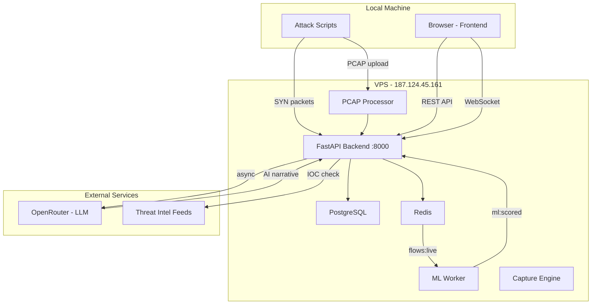
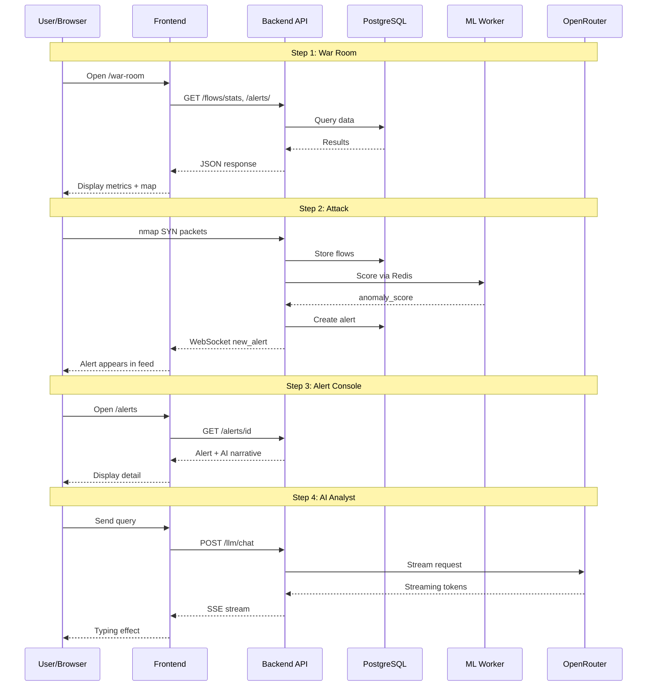

# E2E Real Traffic Walkthrough — Architecture & Data Flow

## System Architecture for Demo Walkthrough

## Data Flow for Each Demo Step

## Component Status Assessment

| Component | Expected | Current Status | Action Needed |
|-----------|----------|----------------|---------------|
| Frontend | Running | Unknown | Verify localhost:3000 or Vercel |
| Backend API | Healthy | ✅ Healthy | None |
| PostgreSQL | Connected | ⚠️ Pending | May need restart |
| Redis | Connected | ✅ Healthy | None |
| ML Worker | Active | ⚠️ Idle | May need restart for live scoring |
| Capture Engine | Active | ⚠️ Idle | Expected - use PCAP upload |
| LLM Gateway | Available | Unknown | Test with chat query |
| Threat Intel | Synced | Unknown | Check IOC count |

## Risk Assessment

| Risk | Probability | Impact | Mitigation |
|------|-------------|--------|------------|
| Database connection fails | Medium | High | Restart backend container |
| ML Worker not scoring | Medium | High | Use PCAP upload (pre-scored) |
| LLM API timeout | Low | Medium | Use cached narratives |
| Frontend build errors | Low | Medium | Use dev server instead |
| WebSocket disconnect | Low | Low | Page still shows data via REST |

## Recommended Approach

Given the current VPS state (ML Worker idle, Capture Engine idle), the **most reliable approach** is:

1. **Use PCAP upload for attack simulation** — bypasses capture engine, uses pre-processed heuristic scoring
2. **Verify existing alerts** — Tasks 1-2 already generated 590 alerts; use these for Steps 3-4
3. **Test live components only** — AI Analyst, Reports, Intel, Admin don't depend on live ML

This minimizes risk while still demonstrating the full E2E pipeline.
