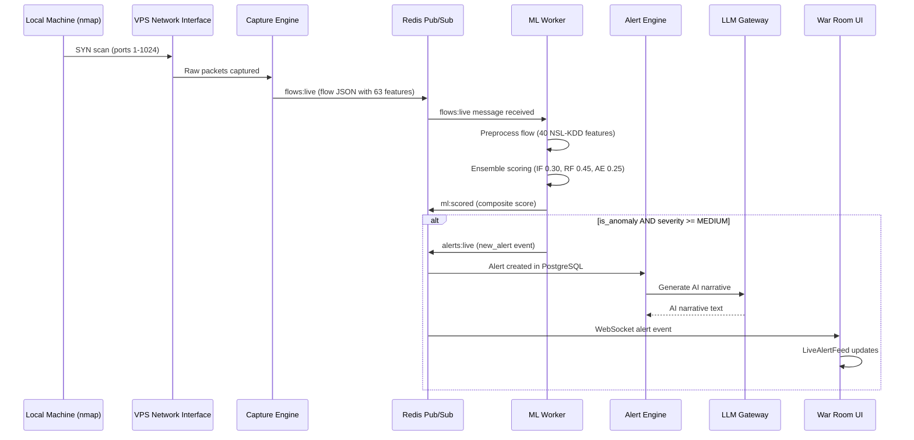

# ThreatMatrix AI — Phase 2: Fresh Attack → Alert Detection Plan

> **Date:** 2026-04-03
> **VPS:** 187.124.45.161:8000
> **Frontend:** http://localhost:3000
> **Reference:** E2E_WALKTHROUGH_PLAN.md Step 2, MASTER_DOC_PART4 §5.3

---

## Executive Summary

Phase 2 executes a live port scan attack from the local machine against the VPS and verifies that the full detection pipeline works end-to-end:

1. **Capture Engine** captures the SYN scan packets
2. **Flow Aggregator** builds flow records with 63 features
3. **ML Worker** scores each flow via the 3-model ensemble
4. **Alert Engine** creates alerts for anomalous flows (severity ≥ MEDIUM)
5. **LLM Gateway** generates AI narrative for each alert
6. **War Room UI** displays the alert in the live feed

---

## Architecture Data Flow



---

## Pre-Flight Checklist

| Check | Command/URL | Expected | Status |
|-------|-------------|----------|--------|
| Backend API | `curl http://187.124.45.161:8000/api/v1/system/health` | status: operational | ⚠️ Verify |
| Capture Engine | `curl http://187.124.45.161:8000/api/v1/capture/status` | status: running | ⚠️ Verify |
| ML Worker | `curl http://187.124.45.161:8000/api/v1/ml/status` | flows_scored > 0 | ⚠️ Verify |
| Frontend | http://localhost:3000/war-room | Page loads | ⚠️ Verify |
| WebSocket | Browser console → WS connection | Connected to ws://187.124.45.161:8000 | ⚠️ Verify |
| nmap installed | `nmap --version` | Available on local machine | ⚠️ Verify |
| Pre-attack alert count | `curl http://187.124.45.161:8000/api/v1/alerts/stats` | Record total_alerts | ⚠️ Record |

---

## Step-by-Step Execution

### Step 1: Record Pre-Attack Baseline

**Purpose:** Establish baseline alert count and system state before attack.

```bash
# Record pre-attack alert count
curl -s http://187.124.45.161:8000/api/v1/alerts/stats

# Record current flow count
curl -s http://187.124.45.161:8000/api/v1/flows/stats

# Record current ML worker status
curl -s http://187.124.45.161:8000/api/v1/ml/status
```

**Record:**
- Pre-attack alert total: _________
- Pre-attack flow total: _________
- ML worker flows_scored: _________

---

### Step 2: Launch Port Scan Attack

**Purpose:** Generate detectable network traffic that should trigger the ML pipeline.

**Command (from local Windows machine):**

```bash
nmap -sS -p 1-1024 187.124.45.161 --max-retries 1 -T4
```

**Alternative (if nmap not available):**

```bash
# Use the project's attack simulation script
cd scripts/attack_simulation
bash 01_port_scan.sh 187.124.45.161
```

**Record:**
- T0 (attack start time): _________ (HH:MM:SS UTC+3)
- Attack type: SYN scan (stealth)
- Target ports: 1-1024
- Target IP: 187.124.45.161

---

### Step 3: Monitor for Alert Detection

**Purpose:** Verify the full pipeline detects and reports the attack.

**Monitoring Methods:**

1. **War Room UI (Visual):**
   - Open http://localhost:3000/war-room
   - Watch LiveAlertFeed component for new alert
   - Look for alert with category "port_scan" or "probe"

2. **API Polling (Automated):**
   ```bash
   # Poll for new alerts every 5 seconds
   for i in $(seq 1 12); do
     sleep 5
     curl -s http://187.124.45.161:8000/api/v1/alerts/?limit=3 | python3 -m json.tool
     echo "--- Poll $i ---"
   done
   ```

3. **Direct Alert Query:**
   ```bash
   # Get latest alert and check category
   curl -s "http://187.124.45.161:8000/api/v1/alerts/?limit=1&sort=desc" | python3 -c "
   import sys, json
   data = json.load(sys.stdin)
   alerts = data.get('items', data) if isinstance(data, dict) else data
   if alerts:
       a = alerts[0]
       print(f'Category: {a.get(\"category\")}')
       print(f'Severity: {a.get(\"severity\")}')
       print(f'Confidence: {a.get(\"confidence\")}')
       print(f'AI Narrative: {a.get(\"ai_narrative\", \"NONE\")[:200]}')
   "
   ```

**Record:**
- T1 (alert appearance time): _________ (HH:MM:SS UTC+3)
- Detection latency (T1 - T0): _________ seconds
- Target: < 60 seconds

---

### Step 4: Verify Alert Properties

**Purpose:** Confirm the alert meets all success criteria.

| Property | Expected | Actual | Pass/Fail |
|----------|----------|--------|-----------|
| category | "port_scan" or "probe" | _________ | 🔲 |
| severity | "medium", "high", or "critical" | _________ | 🔲 |
| confidence | ≥ 0.50 | _________ | 🔲 |
| ai_narrative | Not null/empty | _________ | 🔲 |
| source_ip | Local machine IP | _________ | 🔲 |
| dest_ip | 187.124.45.161 | _________ | 🔲 |

**Full Alert Response (copy verbatim):**

```json
{
  "id": "___",
  "alert_id": "___",
  "severity": "___",
  "title": "___",
  "description": "___",
  "category": "___",
  "source_ip": "___",
  "dest_ip": "___",
  "confidence": ___,
  "status": "___",
  "ai_narrative": "___",
  "created_at": "___"
}
```

---

### Step 5: Verify ML Pipeline Details

**Purpose:** Confirm the ML ensemble correctly classified the attack.

**Expected Classification:**
- Random Forest label: "probe" (per CATEGORY_MAP → "port_scan")
- Isolation Forest: Should flag as anomalous (score > 0.5)
- Ensemble composite score: Should exceed MEDIUM threshold (≥ 0.50)

**Verification Command:**
```bash
# Check ML worker stats after attack
curl -s http://187.124.45.161:8000/api/v1/ml/status | python3 -m json.tool
```

**Record:**
- Flows scored after attack: _________
- Anomalies detected: _________
- Alerts created: _________

---

## Success Criteria

| Criterion | Target | Result |
|-----------|--------|--------|
| Alert appears in War Room | Yes | 🔲 |
| Detection latency | < 60 seconds | _________ s |
| Alert category | "port_scan" | _________ |
| Alert severity | ≥ MEDIUM | _________ |
| ML confidence | ≥ 50% | _________ |
| AI narrative generated | Yes | 🔲 |

---

## Troubleshooting

| Issue | Possible Cause | Resolution |
|-------|---------------|------------|
| No alert after 60s | Capture not monitoring interface | Check `capture/status`, restart capture |
| No alert after 60s | ML Worker not running | Check `ml/status`, restart ml-worker |
| Alert category wrong | RF model misclassifying | Check RF label in alert response |
| Alert severity too low | Composite score below threshold | Check individual model scores |
| AI narrative empty | LLM Gateway timeout | Check LLM status, retry |
| Frontend not updating | WebSocket disconnected | Check browser console, reconnect |

---

## Fallback Options

| Risk | Fallback |
|------|----------|
| nmap not available on Windows | Use Python script: `scripts/attack_simulation/run_external_attacks.py` |
| External attack doesn't produce alert | Use PCAP upload: `curl -X POST http://187.124.45.161:8000/api/v1/capture/upload -F "file=@pcaps/demo/port_scan.pcap"` |
| Alert appears but category wrong | Check CATEGORY_MAP in worker.py: "probe" → "port_scan" |
| War Room not showing alert | Check API directly: `GET /api/v1/alerts/` |

---

## Documentation Requirements

After completing Phase 2, record:

1. **T0 and T1 timestamps** with timezone
2. **Full API response** for the new alert (JSON)
3. **Screenshot** of War Room with alert visible in LiveAlertFeed
4. **Detection latency** calculation
5. **Quality assessment** of AI narrative (1-5 scale)
6. **Any issues encountered** and resolution

---

_Phase 2 Plan — Ready for execution upon approval_
_Reference: E2E_WALKTHROUGH_PLAN.md Step 2, MASTER_DOC_PART4 §5.3, §8_
